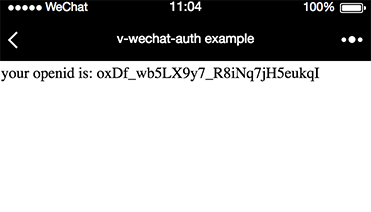

# v-wechat-auth

[](https://www.npmjs.com/package/v-wechat-auth) [](https://vuejs.org/)

> vue 2.0 微信网页授权插件

## 安装

### npm

```bash
npm install --save v-wechat-auth
```

```js
import Vue from 'vue'
import VWechatAuth from 'v-wechat-auth'
```

### 通过 script 标签

```html
<!-- 在 Vue 之后 -->
<!-- 从本地文件 -->
<script src="v-wechat-auth/dist/v-wechat-auth.min.js"></script>

<!-- 从 CDN -->
<script src="https://unpkg.com/v-wechat-auth"></script>
```

## 使用

### 初始化

```js
Vue.use(VWechatAuth)

// 必须在 root 实例上注入 wechatAuth
new Vue({
  el: '#app',
  ...,
  wechatAuth: new VWechatAuth({
    appId: 'your wechat appid',
    scope: 'snsapi_base or snsapi_userinfo'
    authorize () {
      return axios.get('your backend api here', { params: { code: code } })
        .then(function (res) {
          var data = (res && res.data) || {} // response data should at least contain openid
          return data
        })
    }
  })
})
```

### 调用

```js
this.$wechatAuth.authorize()
```

## 运行例子

1. 将 ```examples``` 文件夹中的 ```config.example.js``` 重命名为 ```config.js```

2. 修改 ```config.js```, 填入微信 appid 和 scope, 并在 ```authorize``` 方法中调用后端接口获取用户信息，并将用户信息返回

4. 修改 ```host``` 文件，将微信授权域名映射为 ```localhost```

3. 运行 ```npm run example```

4. 在微信开发者工具中访问 ```授权域名/examples/index.html```（因为修改了host，这时访问的实际上是本地）

5. 能显示当前用户的 ```openid```




## options

| 属性 | 类型 | 必输 | 默认 | 说明 |
|-------|-------|-------|-------|-------|
| autoRedirect | boolean | 否 | true | 当 url 中不包含 code 参数或返回结果中不包含openid时，是否自动重定向到微信授权url |
| appId | string | 是 | | 微信 appid |
| scope | string | 是 | | 微信 scope, ```snsapi_base``` 或 ```snsapi_userinfo``` |
| state | string | 否 | '' | 微信 state |
| authorize | function | 是 | | ajax 请求调用后端接口获取微信用户信息
| ssr | boolean | 否 | | 是否使用服务端渲染，尚未实现 |

## VWechatAuth 实例

| 属性 | 说明 |
|------|------|
| user | 当获取用户信息成功后，存储了用户的信息，否则为一个空对象 |

| 方法 | 参数 | 返回 | 说明 |
|------|------|-------|------|
| authorize | onSuccess，执行成功的回调函数 <br/> onFail，执行失败的回调函数 | Promise | 授权获取用户信息，支持回调函数 和 Promise


## License

[MIT](http://opensource.org/licenses/MIT)
